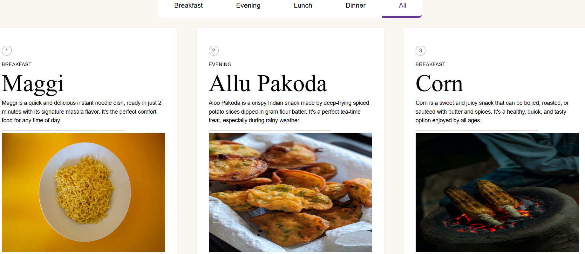

# 🍲 Food Recipe Sorter

A simple and elegant recipe sorter web app that lets users explore food dishes categorized by meal times—**Breakfast**, **Evening**, **Lunch**, and **Dinner**.

## ✨ Features

- Filter recipes by category (**Breakfast**, **Evening**, **Lunch**, **Dinner**, **All**)
- View recipes with **images**, **names**, and **detailed descriptions**
- **Minimal**, **clean card-based layout**

## 🛠️ Tech Stack

**Frontend:** React  
**Styling:** CSS or Tailwind CSS  
**Routing (if applicable):** React Router

## 🚀 Getting Started

To get started with the project, clone the repository, navigate into the folder, install dependencies, and run the development server.

**Step-by-step:**

1. Clone the repository:  
   `git clone https://github.com/abhishekpnaik05/Food-Recipe-Sorter.git`

2. Navigate into the folder:  
   `cd food-recipe-sorter`

3. Install dependencies:  
   `npm install`

4. Run the app:  
   `npm start`

## 📁 Folder Structure

# 🍲 Food Recipe Sorter

A simple and elegant recipe sorter web app that lets users explore food dishes categorized by meal times—**Breakfast**, **Evening**, **Lunch**, and **Dinner**.

## ✨ Features

- Filter recipes by category (**Breakfast**, **Evening**, **Lunch**, **Dinner**, **All**)
- View recipes with **images**, **names**, and **detailed descriptions**
- **Minimal**, **clean card-based layout**

## 🛠️ Tech Stack

**Frontend:** React  
**Styling:** CSS or Tailwind CSS  
**Routing (if applicable):** React Router

## 🚀 Getting Started

To get started with the project, clone the repository, navigate into the folder, install dependencies, and run the development server.

**Step-by-step:**

1. Clone the repository:  
   `git clone https://github.com/your-username/food-recipe-sorter.git`

2. Navigate into the folder:  
   `cd food-recipe-sorter`

3. Install dependencies:  
   `npm install`

4. Run the app:  
   `npm start`

## 📁 Folder Structure

food-recipe-sorter/
├── public/
│   └── index.html
├── src/
│   ├── assets/
│   │   └── images
│   ├── components/
│   │   └── menuCard.jsx
│   │   └── restaurant.js
│   ├── App.js
│   └── index.js
├── package.json
└── README.md

## 🧪 Usage

- Use the **category tabs** at the top to filter the recipes by meal type.  
- Each **recipe card** displays the **dish name**, **description**, and an **image**.  
- The **“All”** tab will display all available recipes regardless of category.

## 📸 Preview

## 📄 License

This project is licensed under the **MIT License**. You’re free to use, modify, and distribute it as needed.
